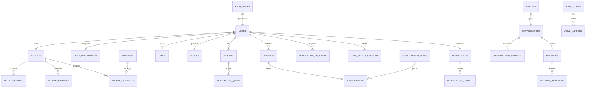

# Database design

All IDs are UUIDs; amounts are integer minor currency units; timestamps are UTC `timestamptz`. Ordered migrations run in transactions and the migration runner records checksums. Data-bearing rollbacks use compensating migrations instead of destructive down scripts.

Auth private identifiers and DOB reside in users; discoverable profile projection contains calculated age and approved photos only. User locations are rounded approximate coordinates and city; coordinates never returned to other members. Flexible explicit values/lifestyle fields are JSON constrained in API validation, while relationships, payments, memberships and interests are relational.

Required auxiliary relations cover education, employment, lifestyle preferences, match preferences, passes, super likes, read receipts, message reports, emergency contacts, date plans, verification results/documents, compatibility scores/factors, AI recommendations, profile views, boosts/user boosts, audit logs, analytics events, feature flags and app settings. RLS is enabled even on deny-by-default infrastructure tables. Configuration and catalog rows contain no personal data; only approved columns/catalogs are client readable.

Indexes support all foreign keys and keyset queries; canonical participant order and unique constraints prevent duplicate matches and conversations. Notifications are committed with business actions. Payment webhooks record dedupe events; plan amount/currency and duration come from the database. Financial history is retained independently of public profile deletion, with pseudonymization defined by legal review.

Test strategy: embedded PostgreSQL (PGlite) runs the actual application migrations with minimal Supabase auth role fixtures. This verifies SQL, constraints, transactions and member/stranger access. It does not substitute for Supabase Auth, Storage or hosted Realtime tests. Hosted tests are an explicit launch gate.

Migration `202610070007_inbox.sql` adds the service-role-only `rpc_inbox` projection,
which derives accessible conversations from authorized matches and `can_chat`,
selects the latest bounded message preview, and counts incoming unread messages
after the actor's `last_read_at`. A partial index accelerates unread-message
selection. Client roles have no execution grant. Additional interest catalog rows
support the supplied onboarding design without creating member accounts. All seven
migrations execute in the embedded SQL/REST integration suites. Migration 008
protects the custom migration ledger with RLS and revoked client privileges and
enforces private photo/evidence bucket configuration. The SQL Editor installer
adds all nine migrations with canonical LF checksums shared with the runner.
